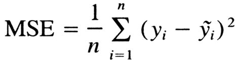
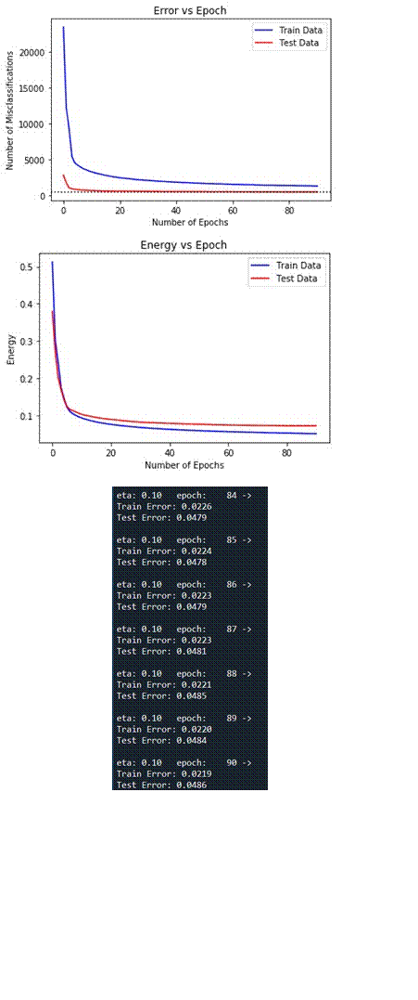
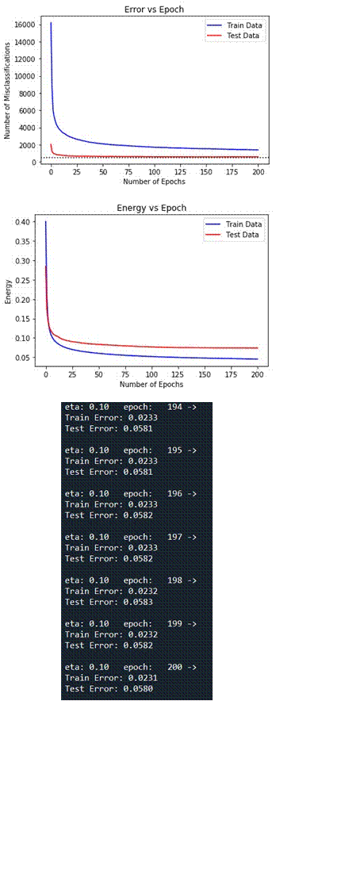
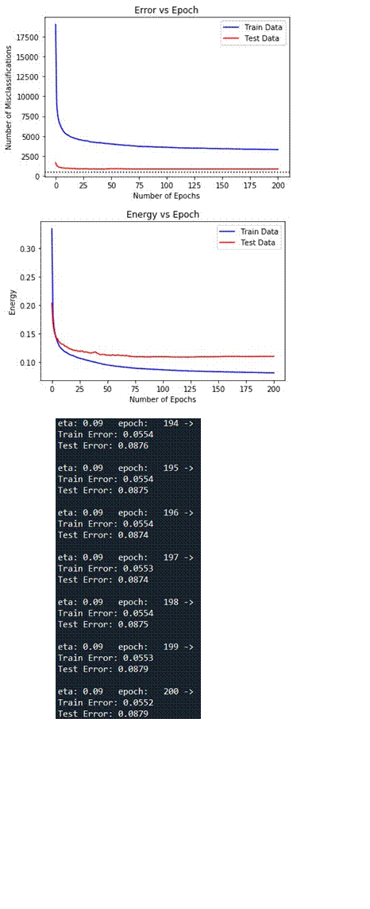
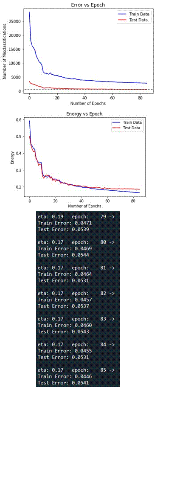
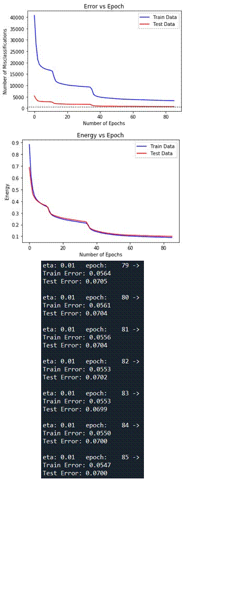

# Backpropagation Algorithm for MNIST Digit Classification

This python program implements the backpropagation algorithm in order to classify the handwritten images in the MNIST dataset. The MNIST dataset consists of 60,000 training samples and 10,000 testing samples. Numpy is used to handle the multi-dimensional array data and Matplotlib is used for plotting the results. Various aspects and decisions regarding the algorithm and parameter tuning are explained in detail below. 

1. Network topology:  
   * Since the input is of the form 28 x 28, we have 784 distinct inputs (which will be the input layer).  
   * One hidden layer was tested with varying number of neurons.
   * The output layer consists of 10 neurons, one neuron for each digit in one-hot encoding format. 

2. Output layer representation: 
   * As mentioned before, 10 output neurons have been used, one for each digit in the one-hot encoding format for our output. The desired output has also been encoded in one-hot representation. 
   * The approach is intuitive since we can use certain activation functions for the output layer where each digit has a certain probability of being the answer. 
   * Using one neuron for the output would have probably required using ReLU activation function but will be problematic for outputs greater than 10 (since we only want 0 to 9 for prediction). 

3. Activation functions: 
   * Hyperbolic tangent activation function is chosen for the hidden layer, as it squashes the output between -1 and 1, and they are odd functions. It deals with any outliers in the data, and brings the mean closer to 0, hence centering the data. 
   * Sigmoid activation function is chosen for the output layer, as output can be interpreted in terms of probabilities. The sum of probabilities for all 10 neurons will not add up to 1, like in soft-max, but we can still simply choose the highest value to be our answer (as we need one-hot encoding). 
   * Again, these activation functions have been chosen over their alternatives, not only because they make more sense for this task, but also because they are differentiable, and easy to compute. 
   * Also, sigmoid was not used in the hidden layer because of the vanishing gradient problem. 

4. Learning rates, and dynamic updates of the learning rates: 
   * 0.1 has been chosen as the learning rate, as seen for different runs with learning rates larger or smaller than that, the algorithm either could not converge in the same number of epochs (small updates) or was bound to diverge. 
   * If the energy did increase while for a certain epoch, we simply scale the learning rate by 0.9 as done in the previous assignment. 
   * Now, we know learning rate should be smaller for last layers, but neurons with less inputs should also have larger learning rates. Since our last layer has less inputs, it is sort of balanced out, hence all neurons were supplied with the same learning rate for this experiment. 

5. Energy function: 

   * Simple energy function was used, which is the Mean Squared Error (MSE): 

     

   * Again, this is easy to compute and works well for our vector output representation. 

6. Input normalization and weight initialization: 
   * The input has been ‘mean normalized’, where they are subtracted by the mean of the training data and divided by the (maximum - minimum) of the training data (which in MNIST data is 255 – 0 = 255).
   * This is different from the Z-score normalization because it makes sure all the values are between -1 and +1, with the mean being 0.
   * Weights have been initialized randomly from a normal distribution, with the mean = 0, and the standard deviation as 1. 

7. Number of neurons and layers: 
   * I started with one layer, because it is simpler to implement, and it could achieve the target (>95% accuracy on test data). It does not make sense to implement complex networks when the desired results can be achieved by simpler ones. What two layers can achieve, can be done with one layer too (although by increasing the number of neurons in that one layer). 
   * Now, for the one hidden layer used to implement the algorithm, I started with 15 neurons, increasing it till we achieve the results (as seen in the results table below). 
   * This is because, generally it is recommended to keep hidden neurons between number of inputs and number of output neurons. 

8. Results: 
   * I have kept a threshold of 200 on the number of epochs, since generally I observed that the testing accuracy flatlined after around 100-150 epochs (algorithm started overfitting on the training data). 
   * So, for 15 and 50 epochs, the algorithm simply could not converge within 200 epochs. 
   * But when it was increased to 75 neurons, the algorithm converged (hit 95% test accuracy) in around 69 epochs, after that slowly overfitting took place, so it had to be terminated at 85 epochs. 
   * Even though the goal was achieved, I tried to run for 100 epochs to simply see the difference in results. This run gave me the best result, with 1.08% error on the training data and 4.19% on the test data. Again, if left running for too long, the algorithm started overfitting. 
   * Now, the learning rate was set to 0.1 due to reasons discussed in (4), and as seen in results table.
   * Random seed was set to 0 to avoid getting different results for the same hyperparameters. 
   * Finally, 0.9 for 1 and 0.1 for 0 was used for one-hot encoding to avoid saturation of weights (since we are using sigmoid activation function for output layer).
   * **TanH** activation function is used for the hidden layer and **Sigmoid** for output layer. 

| **No.** | **Hidden Neurons** | **Learning Rate** | **Epochs** | **Train**    **Error**    **(%)** | **Test**    **Error**    **(%)** | **Test Size** | **Train  Size** | **Random Seed** |
| :-----: | :----------------: | :---------------: | :--------: | :-------------------------------: | :------------------------------: | :-----------: | :-------------: | :-------------: |
|    1    |         75         |       0.10        |     85     |               2.24                |               4.78               |     10000     |      60000      |        0        |
|    2    |         50         |       0.10        |    200     |               2.31                |               5.80               |     10000     |      60000      |        0        |
|    3    |         15         |       0.10        |    200     |               5.53                |               8.74               |     10000     |      60000      |        0        |
|    4    |        100         |       0.10        |    200     |               1.08                |               4.25               |     10000     |      60000      |        0        |
|    5    |         75         |       1.00        |     85     |               4.46                |               5.41               |     10000     |      60000      |        0        |
|    6    |         75         |       0.01        |     85     |               5.47                |               7.00               |     10000     |      60000      |        0        |

9. Plots: 
   * There are two graphs for each result in the above table (with each having train as well as test plot: 
     1. Epoch vs classification error.
     2. Epoch vs energy.
     3. Final printed error rates (adjusted for size). 
   * The blue line is for training data, while red line is for the test data. 
   * The black dotted line represents the error threshold (5% of 10,000 or 500 misclassifications) for the test data.
   
   

## fig a: 75 Neurons (learning rate -> 0.1)

---

## fig b: 50 Neurons (learning rate -> 0.1)

---

## fig c: 15 Neurons (learning rate -> 0.1)

---

## fig d: 100 Neurons (learning rate -> 0.1)

---

## fig e: 75 Neurons (learning rate -> 1.0)

---

## fig f: 75 Neurons (learning rate -> 0.01)

---

## Refer:

1. [Backpropagation Algorithm](https://en.wikipedia.org/wiki/Backpropagation)
2. [MNIST dataset](http://yann.lecun.com/exdb/mnist/)

## Libraries Used

1. Struct - to read the binary files.
2. Numpy library is used to store and manipulate the data.
3. Matplotlib is used in order to plot the results.